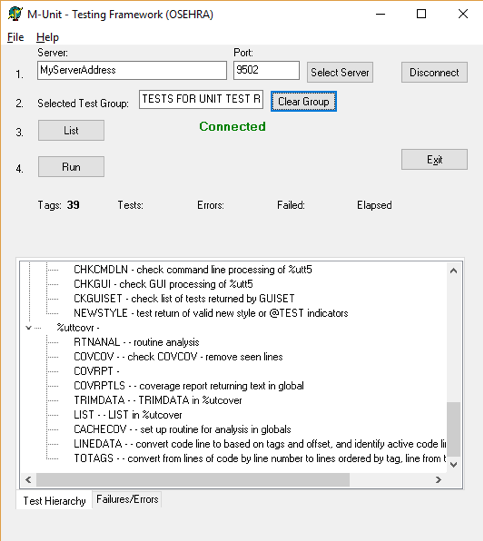
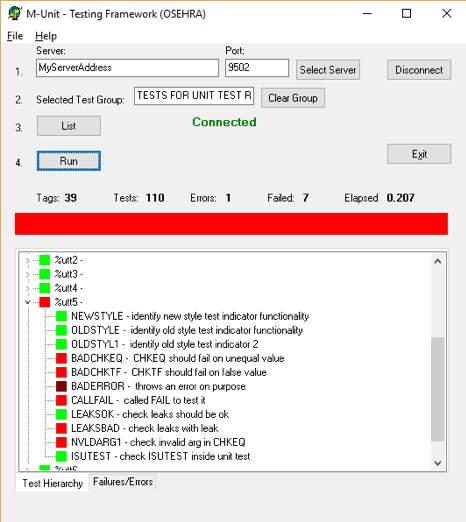
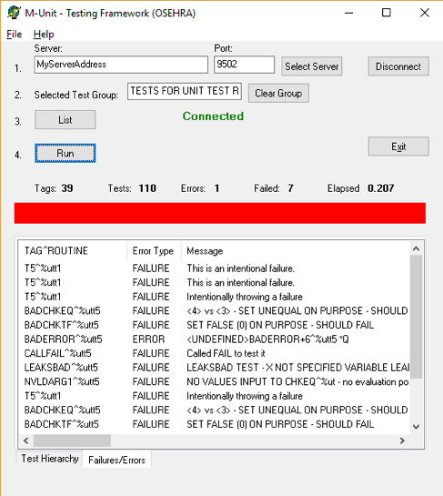
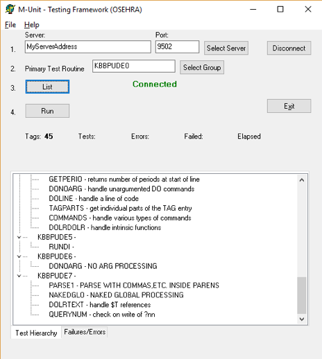
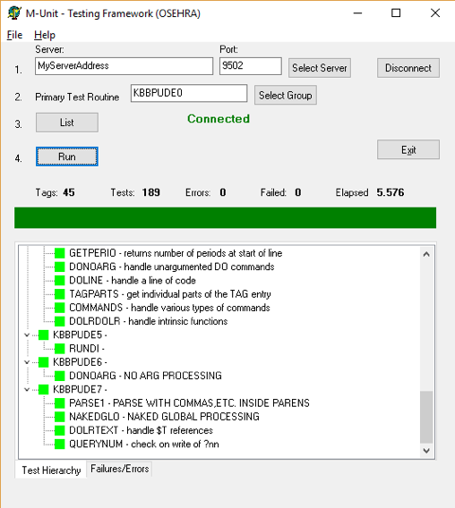
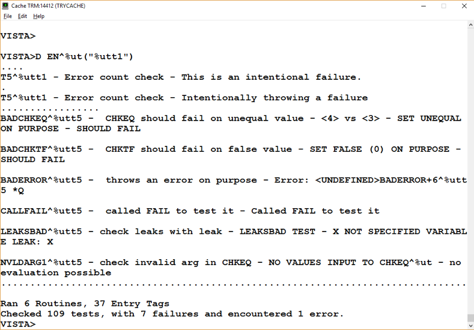
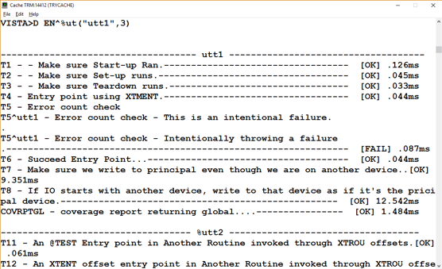
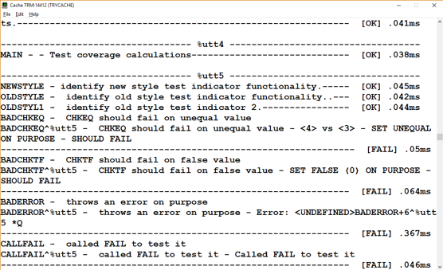
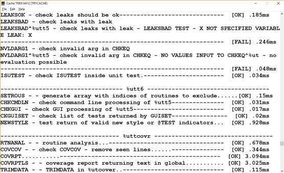
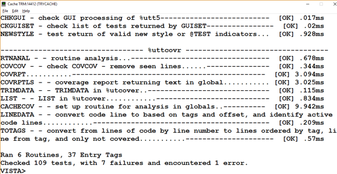

# M-Unit Technical Article

## Introduction

This tool permits a series of tests to be written addressing specific tags or
entry points within a project and act to verify that the return results are as
expected for that code. The significance of this is that, when run routinely
any time that the project is modified, it will act to indicate whether the
intended function has been modified inadvertently or whether the modification
has had unexpected effects on other functionality within the project. The set
of unit tests for a project should run rapidly (usually within a matter of
seconds) and with minimal disruption for developers. Another function of unit
tests is that they indicate what the intended software was written to do. The
latter may be especially useful when new developers start working with the
software or a programmer returns to a project after a prolonged period.

The concept of Unit Testing was already in place before Kent Beck created
a tool that he used in the language Smalltalk, and then was turned into the
tool Junit for Java by Kent Beck and Erich Gamma. This tool for running
specific tests on facets of a software project was subsequently referred to as
xUnit, since NUnit was developed for .NET developers, DUnit for Delphi
developers, etc. M-Unit is the equivalent tool for M developers to use and was
originally created in 2003.

This version (1.6) includes a number of improvements and changes.

 * Refactoring of code coverage
 * Support to be a YottaDB plugin
 * Shorter and lowercase names for CHKEQ (EQ), CHKTF (TF), SUCCEED, FAIL and EN
 * Longer routine name support for code coverage report
 * Various bug fixes

## Using M-Unit

The M-Unit functionality is contained in the `%ut`, `%ut1` and `%utcover`
routines. The code was originally written by Joel Ivey when he was working as
a developer for the Department of Veteran Affairs. The code had input as
suggestions by several other developers both inside and outside of the VA,
including Kevin Meldrum and especially Sam Habiel who made significant
contributions to the current status including modifications to the preinstall
routine for Caché to improve setting the `%ut` namespace for routines and
globals to the current VistA partition. Current development is being continued
as problems or improvements are identified.

```M
%ut ;VEN-SMH/JLI - PRIMARY PROGRAM FOR M-UNIT TESTING ;02/11/17  11:07
 ;;1.5;MASH UTILITIES;;Feb 8, 2017;
 ; Submitted to OSEHRA Feb 8, 2017 by Joel L. Ivey under the Apache 2 license (http://www.apache.org/licenses/LICENSE-2.0.html)
 ; Original routine authored by Joel L. Ivey as XTM-Unit while working for U.S. Department of Veterans Affairs 2003-2012
 ; Includes addition of %utVERB and %utBREAK arguments and code related to them as well as other substantial additions authored by Sam Habiel 07/2013-04/2014
 ; Additions and modifications made by Sam H. Habiel and Joel L. Ivey 2013-02/2017 ;
 ;
 ; This routine and its companion, %ut1, provide the basic functionality for
 ; running unit tests on parts of M programs either at the command line level
 ; or via the M-Unit GUI application for windows operating systems.
 ;
 ; Original by Dr. Joel Ivey (JLI)
 ; Contributions by Dr. Sam Habiel (SMH)
```

From a user's perspective the basic start for unit tests from the command line
is the entry point `EN^%ut`, the first argument is the name of the routine to
be tested and is required, but the tag can take up to two additional arguments:
a verbose indicator and a `BREAK` indicator, both of these require a non-zero
value to activate them.

```M
DO EN^%ut("ROUTINE_NAME")
do en^%ut("ROUTINE_NAME")
```

or

```M
DO EN^%ut("ROUTINE_NAME",VERBOSE,BREAK)
do en^%ut("ROUTINE_NAME",VERBOSE,BREAK)
```

The command with a single argument will result in the unit tests being run and
each successful test is shown by a period ('.') followed by specification of
the number of tags entered, the number of tests run, the number of failures,
and the number of errors encountered. Instead of the period for successes,
failures or errors are indicated by the tag and routine name for the specific
test, a description of the test if provided, and a message concerning the
failure if provided or the line and routine at which the error occurred. The
verbose option will result in a listing of each test that is executed, which
may make it more difficult to identify problems if they have occurred. The
`BREAK` option will result in termination of the unit test as soon as a failure
or error is encountered, this is not usually recommended, since only a part of
the unit tests (and potential problems) will have been examined. The unit tests
will normally continue even if errors are encountered.

The code written in a unit test routine has specific entry points that should
indicate a specific set of functionality being tested. The tag may have more
than one test, but these should all focus on the same aspect being tested.
Originally specification of the tags and a description of the functionality
being tested by the tag testing were entered following an `XTENT` tag in the
following manner.

```M
XTENT   ;
        ;;TEST1;Testing functionality for one feature
        ;;ANEW1;Testing another piece of functionality
        ;;ATHIRD;Testing still something else
```

More recently, an alternative method was added similar to the annotation used
in C#, thanks to the suggestion of Kevin Meldrum. The indicator `@TEST` is
specified as the first string following the semi-colon on the same line as the
tag, and a description can then be added following this indicator.

```M
TEST4   ; @TEST another test for different functionality
```

Most recently, an additional indicator was added to identify specific tests
which should be run while ignoring others thanks to the suggestion of Sam
Habiel. The indicator `!TEST` is specified as the first string following the
semi-colon on the same line as the tag, and a description can then be added
following this indicator.

```M
TEST4   ; !TEST ignore other tests not marked like this during run
```

Since there will frequently be multiple routines with tests created to test
a specific project, these can be indicated in a manner similar to the original
description of the entry tags, following a `XTROU` tag. The following could be
used to link additional test routines to a `ZZUXQA1` test routine.

```M
XTROU   ;
        ;;ZZUXQA2
        ;;ZZUXQA3
        ;;ZZUXQA4
```

The other routines can also reference these as well, or additional related test
routines. Each routine would be included only once, no matter how many of the
other routines reference it in this manner.

A test routine can use one of three types of calls for its tests, determining
truth, equivalence, or simply indicating failure for the test. In each of these
a final argument can be used to specify information about the specific test
result.

Truth is tested by the command

```M
DO CHKTF^%ut(TorF,message)
DO TF^%ut(TorF,message)
do tf^%ut(TorF,message)
```

where `TorF` is a value to be tested for true (passing the test) or false
(failing the test).

Equivalence is tested by the command

```M
DO CHKEQ^%ut(expected,result,message)
DO EQ^%ut(expected,result,message)
do eq^%ut(expected,result,message)
```

where `expected` is the value that is expected from the test, and `result` is
the value that was obtained and should be equal to `expected` if the test is to
pass. If a test fails, the expected value and the observed values are shown
along with the `message` indicating the test that failed.

Failure already determined is specified by the command

```M
DO FAIL^%ut(message)
do fail^%ut(message)
```

and is generally used when the processing has reached an area that it shouldn't
be expected to reach given the circumstances, and `message` then describes the
situation.

In certain circumstances, such as when just running code and needing to assert
that the code didn't crash (which M-Unit captures automatically as an error),
you can run this command

```M
DO SUCCEED^%ut
do succeed^%ut
```

The M-Unit functionality is set up to capture information on errors, and to
continue processing the remaining tests within the tag as well as additional
tags.

There are four other tags that have meaning to the M-Unit functionality
- `STARTUP`, `SETUP`, `TEARDOWN`, and `SHUTDOWN`. Frequently, to provide
specific data to use for testing, it may be necessary to add data which is
totally temporary, either for all tests in one pass, or before each test is
run.

The `STARTUP` tag specifies code that should be run once when the testing of
a routine is starting up. If multiple routines should use the same `STARTUP`
code, they can have a `STARTUP` tag that then runs the code in one of the
routines. Its companion is `SHUTDOWN`, which if present, will be run only after
all of the tests have been completed within a routine. Again, if multiple
routines should use the same `SHUTDOWN` code they can each have a `SHUTDOWN`
tag and then run the code in one of the routines. This is a change from the
prior version, where `STARTUP` was run only at the start of a unit test
sequence and `SHUTDOWN` only at the conclusion of all tests. However, this was
found to cause problems if a suite of multiple unit tests from different
applications were being run (e.g., by creating a primary unit test routine
which referred to multiple test routines creating a suite of tests), and more
than one of the applications required its own `STARTUP` and `SHUTDOWN` code.

The `SETUP` tag specifies code that should be run before each test tag in
a given routine is run, there could be similar `SETUP` tags in other routines
as well. Its companion is `TEARDOWN` which, if present, will be run immediately
after each test tag is processed.

It should be noted that care should be taken in using these four tags, since
they may end up hiding significant functionality from testing or result in
problems later if changes are made to the tests (which would then be converted
into changes in the project related to the tests).

The extrinsic function `$$ISUTEST^%ut` can be used to determine whether code is
currently running within a unit test or not. The value returned will be true if
it is currently in a unit test and false if it is not. This can be used within
code that would likely be used under testing to determine whether user
interaction might be requested or not, or to set a default value for testing
purposes.

An additional tag `CHKLEAKS^%ut` is available for checking for variable leaks
as a part of a unit test. This functionality can also be called outside of unit
tests as well.

```M
CHKLEAKS(%zuCODE,%zuLOC,%zuINPT) ; functionality to check for variable leaks on executing a section of code
 ; %zuCODE - A string that specifies the code that is to be XECUTED and checked for leaks.
 ;            this should be a complete piece of code
 ;                 (e.g., "S X=$$NEW^XLFDT()" or "D EN^%ut(""ROUNAME"")")
 ; %zuLOC  - A string that is used to indicate the code tested for variable leaks
 ; %zuINPT - An optional variable which may be passed by reference.  This may
 ;           be used to pass any variable values, etc. into the code to be
 ;           XECUTED.  In this case, set the subscript to the variable name and the
 ;           value of the subscripted variable to the desired value of the subscript.
 ;              e.g., (using NAME as my current namespace)
 ;                   SET CODE="SET %zuINPT=$$ENTRY^ROUTINE(ZZVALUE1,ZZVALUE2)"
 ;                   SET NAMELOC="ENTRY^ROUTINE leak test"   (or simply "ENTRY^ROUTINE")
 ;                   SET NAMEINPT("ZZVALUE1")=ZZVALUE1
 ;                   SET NAMEINPT("ZZVALUE2")=ZZVALUE2
 ;                   DO CHKLEAKS^%ut(CODE,NAMELOC,.NAMEINPT)
 ;
 ;           If part of a unit test, any leaked variables in ENTRY^ROUTINE which result
 ;           from running the code with the variables indicated will be shown as FAILUREs.
 ;
 ;           If called outside of a unit test, any leaked variables will be printed to the
 ;           current device.
 ;
```

The `COV^%ut` API can be used to initiate coverage analysis of unit tests.
Previously this functionality was limited to the GT.M version of M[UMPS], but
the current release now provides support for coverage analysis in Intersystems
Caché as well. In the original release, this functionality was only available
by calling `COV^%ut1`, but the tag has been moved to `%ut` to make it more
convenient to use. A couple of newly added related APIs are described below as
well. The `COV^%ut` API has three arguments

```M
DO COV^%ut (.NAMESPACE,CODE,VERBOSITY)
```

where `NAMESPACE` specifies the routines to be included in the analysis. If the
value does not include an asterisk at the end, then only the routine matching
the specified name would be included (e.g, `KBBPDEB1`, would only include the
routine `KBBPDEB1` in the analysis). If the `NAMESPACE` value ends in an
asterisk, then all routines starting with the initial characters will be
included in the analysis (e.g., `KBBPD*` would include all routines with names
starting with `KBBPD` in the analysis). Namespace may also be passed as the
arguments of an array (e.g., `NAMESPACE="KBBPDEB1*","NAMESPACE("KBBPDEB2*")=""`
will run coverage analysis on both namespaces. This may also be used to specify
all individual routines to be included in the coverage analysis.

CODE specifies the code command that should be run for the analysis. Thus, `DO
EN^%ut(""KBBPUDE1"")` would run the routine `KBBPUDE1` and any that it might
call for the coverage analysis.

`VERBOSITY` determines the amount of detail to be displayed. A value of 0 or
1 will provide only an analysis of the lines covered out of the total number to
be counted (non-code lines are not included in the coverage analysis) for each
routine in the analysis, as well as covered and totals for all routines.
A value of 2 will also include coverage data for each tag in the routines.
A value of 3 will provide the data provided by 1 and 2, but also will list each
line for a tag that was not covered during running of the routine(s), so that
lines lacking coverage can be determined. A value of -1 will return all data in
globals for the calling application to evaluate and present.

The `COVERAGE^%ut` API has been added to make it easier to analyze the coverage
data while having it omit the data on routines that shouldn't be included in
the analysis (e.g., those routines which are only unit test routines). It also
permits different APIs to be called within the same analysis, so that coverage
can be better approximated if different pieces of code need to be called (e.g.,
an entry point to run unit tests without the verbose flag, and another with the
verbose flag, since both count as lines of code). This functionality is
available in both Caché and GT.M systems.

```M
DO COVERAGE^%ut(.NAMESPACE,.TESTROUS,.XCLUDE,VERBOSITY)
```

Where `NAMESPACE` functions in the same manner as described for `COV^%ut`
(e.g., `%ut*`) and is passed by reference as well.

`TESTROUS` is an array specifying the desired APIs that should be called and is
passed by reference. If the subscript is non-numeric, it will be interpreted as
a routine specification to be used. The values of the array may also be a comma
separated list of APIs to be used during the analysis. If an API includes a '^'
(as either `TAG^ROU` or `^ROU`) then it will be run as `DO TAG^ROU` or `DO
^ROU`. If the API does not include a '^' then it will be run as `DO
EN^%ut("ROU")`. An array could look like

```M
SET TESTROUS(1)="^%ut,^%ut1"
SET TESTROUS("%utt1")="VERBOSE^%ut1"
```

which would cause the unit tests `DO ^%ut`, `DO ^%ut1`, `DO EN^%ut("%utt1")`,
and `DO VERBOSE^%ut1` to be run.

`XCLUDE` is an array specifying the names of routines that should be excluded
from the coverage analysis, and can also be specified as either arguments or as
a comma separated list in the value. Thus,

```M
SET XCLUDE("%utt1")="%utt2,%utt3,%utt4,%utt5,%utt6,%uttcovr"
```

would result in only the functioning routines in `%ut*` being included in the
coverage analysis.

The `VERBOSITY` argument can have the 0 through 3 values as described above.

The `MULTAPIS^%ut` API has been added to provide capabilities to run multiple
sets of unit tests in the same manner as with the `COVERAGE^%ut` API, but it
does not attempt to perform any coverage analyses. It has a single argument is
passed by reference and has the same capabilities as `TESTROUS` above. Usage is
as

```M
DO MULTAPIS^%ut(.TESTROUS)
```

The new `GETUTVAL^%ut` and `LSTUTVAL^%ut` APIs can be used to generate
cumulative totals If a routine with code to run multiple unit tests is created
by calling the `GETUTVAL^%ut` API after each test passing a variable (which can
be undefined initially) by reference to create an array containing a cumulative
total for the tests. At the conclusion, the `LSTUTVAL^%ut` API can then be
called to print the cumulative totals.

```M
DO GETUTVAL^%ut(.TESTSUM)
```

Then

```M
DO LSTUTVAL^%ut(.TESTSUM)
```

Will present the summary listing of values for the tests.

The GUI M-Unit application provides a visually interactive rapid method for
running unit tests on M code.


*Figure 1. Selection of an M-Unit test*

After specifying the server address and port, the user can sign on and then
click the Select Group button to select a unit test from the M-UNIT TEST GROUP
file (#17.9001) as shown here (Figure 1), or simply enter the name of a unit
test routine in the Primary Test Routine field and click on List. This will
bring up a list of the routines and tags in the unit test run (Figure 2).


*Figure 2. List of Unit tests selected for running*

Clicking the Run button will run the unit tests, resulting in a bar which is
green if all tests pass or red if any failures or errors are encountered
(Figure 3).


*Figure 3. The unit tests run with failures*

If failures or errors are encountered, clicking on the Failures/Errors tab at
the bottom of the listing opens a display of specific information on the
problems.


*Figure 4. Specifics on failed tests or errors*

In the case shown (Figure 4), all of the failures are intentional. Usually,
failures and/or errors are not intentional and the user can then edit the
routine, and save the changes, then simply click on the Run button again to see
the effect of the changes.

To select a new unit test, the user would click on the Clear Group button, then
again either select another group or as shown in Figure 5, entering the name of
a unit test routine (KBBPUDE0 and related routines are not included with the
M-Unit Test code and is shown only as an example) and clicking on the List
button.


*Figure 5. Specification of unit tests by routine name*

Again, clicking the Run button will run the unit tests (Figure 6). This figure
shows the desired result, a green bar meaning that all tests passed.


*Figure 6. Result from the second group of unit tests*

The results of `%utt1` and related routines run at the command line without the
verbose flag are shown in Figure 7.


*Figure 7. Command line unit tests for %utt1*

The results of the single `%utt1` unit test routine (and its related routines)
run with the `VERBOSE` option, that some people prefer, specified permits the
individual tests and their results to be seen, but makes the results more
difficult to interpret (Figure 8).





*Figure 8. Command line unit tests for %utt1 with VERBOSE option 3*

### Running Coverage Analysis of Unit Tests for the M-Unit code

Running the routine `^%uttcovr` from the top (I.e., `D ^%uttcovr`) runs
a series of unit tests including from the top of each of the routines `^%ut`,
`^%ut1`, and `^%utcover`, which each run unit tests when run from the top, as
well as the regular unit tests. As noted earlier, the fourth argument of the
`COVERAGE^%ut` API determines the verbosity of the results, and the `^%uttcovr`
analysis runs the verbosity 3, which the most detailed level. The results of
the `COVERAGE^%ut` API are presented in the order of most detailed first so
that the final output is the summary, and the user can scroll back for details.
As the analysis runs, the output lists each set of unit tests preceeded by
a header indicating how the test routine was ran: a routine name without the up
arrow indicates it was started with the command `D EN^%ut`, while those with an
up arrow indicate it was started by running the routine from the top or from
a specified tag.

Routine ran by `D EN^%ut`

```sh
“------------------- RUNNING %utt1 ------------------- “
```

Routine ran from the top or a specified tag

```sh
“------------------- RUNNING ^%utt1 -------------------”
```

When the coverage is run with a verbosity value of zero or one, it presents
only the least detailed item, the coverage by routine and total coverage for
the analyzed routines (the coverage on a Caché system is shown)

```sh
Routine %ut      (96.41%)   295 out of 306 lines covered
Routine %ut1      (86.64%)   227 out of 262 lines covered
Routine %utcover     (100.00%)   108 out of 108 lines covered

Overall Analysis 630 out of 676 lines covered (93% coverage)
```

When the coverage is run with a verbosity value of two, it presents the
coverage by tag within the routines as well. Before presenting the summary by
routine and overall. The output for `%ut` and `%ut1` is shown below for a Caché
system (the output for `%utcover` showed 100.00% for all tags).

```sh
Routine %ut             (96.41%)   295 out of 306 lines covered
  - Summary
 Tag %ut^%ut              (100.00%)   2 out of 2 lines covered
 Tag CHKEQ^%ut            (100.00%)   18 out of 18 lines covered
 Tag CHKLEAKS^%ut         (100.00%)   2 out of 2 lines covered
 Tag CHKTF^%ut            (100.00%)   15 out of 15 lines covered
 Tag COV^%ut              (100.00%)   2 out of 2 lines covered
 Tag COVERAGE^%ut         (100.00%)   2 out of 2 lines covered
 Tag DOSET^%ut            (100.00%)   6 out of 6 lines covered
 Tag EN^%ut               (100.00%)   7 out of 7 lines covered
 Tag EN1^%ut              (100.00%)   68 out of 68 lines covered
 Tag EQ^%ut               (100.00%)   2 out of 2 lines covered
 Tag ERROR^%ut            (100.00%)   9 out of 9 lines covered
 Tag ERROR1^%ut           (100.00%)   9 out of 9 lines covered
 Tag FAIL^%ut             (100.00%)   2 out of 2 lines covered
 Tag GETLIST^%ut          (100.00%)   12 out of 12 lines covered
 Tag GETSET^%ut           (100.00%)   4 out of 4 lines covered
 Tag GETSYS^%ut           (100.00%)   3 out of 3 lines covered
 Tag GETUTVAL^%ut         (100.00%)   5 out of 5 lines covered
 Tag GTMVER^%ut             (0.00%)   0 out of 1 lines covered
 Tag GUILOAD^%ut          (100.00%)   8 out of 8 lines covered
 Tag GUINEXT^%ut          (100.00%)   43 out of 43 lines covered
 Tag GUISET^%ut           (100.00%)   8 out of 8 lines covered
 Tag ISUTEST^%ut          (100.00%)   1 out of 1 lines covered
 Tag LOAD^%ut             (100.00%)   10 out of 10 lines covered
 Tag LSTUTVAL^%ut         (100.00%)   4 out of 4 lines covered
 Tag MULTAPIS^%ut         (100.00%)   2 out of 2 lines covered
 Tag PICKSET^%ut          (100.00%)   3 out of 3 lines covered
 Tag RUNSET^%ut           (100.00%)   9 out of 9 lines covered
 Tag SETUT^%ut            (100.00%)   6 out of 6 lines covered
 Tag SUCCEED^%ut          (100.00%)   6 out of 6 lines covered
 Tag TF^%ut               (100.00%)   2 out of 2 lines covered
 Tag VERBOSE^%ut          (100.00%)   11 out of 11 lines covered
 Tag VERBOSE1^%ut         (100.00%)   4 out of 4 lines covered
 Tag ZHDIF^%ut              (0.00%)   0 out of 10 lines covered
 Tag en^%ut               (100.00%)   2 out of 2 lines covered
 Tag eq^%ut               (100.00%)   2 out of 2 lines covered
 Tag fail^%ut             (100.00%)   2 out of 2 lines covered
 Tag succeed^%ut          (100.00%)   2 out of 2 lines covered
 Tag tf^%ut               (100.00%)   2 out of 2 lines covered


Routine %ut1            (86.64%)   227 out of 262 lines covered
  - Summary
 Tag %ut1^%ut1            (100.00%)   2 out of 2 lines covered
 Tag ACTLINES^%ut1        (100.00%)   10 out of 10 lines covered
 Tag CACHECOV^%ut1         (72.73%)   8 out of 11 lines covered
 Tag CHECKTAG^%ut1        (100.00%)   5 out of 5 lines covered
 Tag CHEKTEST^%ut1        (100.00%)   17 out of 17 lines covered
 Tag CHKTAGS^%ut1         (100.00%)   10 out of 10 lines covered
 Tag COV^%ut1              (61.76%)   21 out of 34 lines covered
 Tag COVCOV^%ut1          (100.00%)   9 out of 9 lines covered
 Tag COVRPT^%ut1          (100.00%)   5 out of 5 lines covered
 Tag COVRPTLS^%ut1        (100.00%)   31 out of 31 lines covered
 Tag FAIL^%ut1            (100.00%)   12 out of 12 lines covered
 Tag GETRTNS^%ut1          (36.84%)   7 out of 19 lines covered
 Tag GETTAG^%ut1          (100.00%)   4 out of 4 lines covered
 Tag GETTREE^%ut1         (100.00%)   7 out of 7 lines covered
 Tag GETVALS^%ut1         (100.00%)   11 out of 11 lines covered
 Tag GTMCOV^%ut1            (0.00%)   0 out of 4 lines covered
 Tag LINEDATA^%ut1        (100.00%)   9 out of 9 lines covered
 Tag NEWSTYLE^%ut1        (100.00%)   4 out of 4 lines covered
 Tag NVLDARG^%ut1         (100.00%)   11 out of 11 lines covered
 Tag RESETIO^%ut1         (100.00%)   2 out of 2 lines covered
 Tag RTNANAL^%ut1          (89.66%)   26 out of 29 lines covered
 Tag SETIO^%ut1           (100.00%)   2 out of 2 lines covered
 Tag TOTAGS^%ut1          (100.00%)   13 out of 13 lines covered
 Tag UP^%ut1              (100.00%)   1 out of 1 lines covered


Routine %utcover       (100.00%)   108 out of 108 lines covered
  - Summary
 Tag %utcover^%utcover    (100.00%)   2 out of 2 lines covered
 Tag CHKLEAKS^%utcover    (100.00%)   13 out of 13 lines covered
 Tag COVENTRY^%utcover    (100.00%)   15 out of 15 lines covered
 Tag COVERAGE^%utcover    (100.00%)   14 out of 14 lines covered
 Tag COVRPTGL^%utcover    (100.00%)   14 out of 14 lines covered
 Tag LIST^%utcover        (100.00%)   38 out of 38 lines covered
 Tag MULTAPIS^%utcover    (100.00%)   5 out of 5 lines covered
 Tag SETROUS^%utcover     (100.00%)   4 out of 4 lines covered
 Tag TRIMDATA^%utcover    (100.00%)   3 out of 3 lines covered
```

When the same analysis is run with a verbosity value of 3 (the value used when
the `^%uttcovr` routine is run from the top) the output for %ut1 (the tags
following `COVRPT^%ut1` all showed 100.00% coverage as before) also shows the
lines that were NOT covered in the `COV^%ut1` tag.

```sh
Routine %ut             (96.41%)   295 out of 306 lines covered
  - Detailed Breakdown
 Tag %ut^%ut              (100.00%)   2 out of 2 lines covered
 Tag CHKEQ^%ut            (100.00%)   18 out of 18 lines covered
 Tag CHKLEAKS^%ut         (100.00%)   2 out of 2 lines covered
 Tag CHKTF^%ut            (100.00%)   15 out of 15 lines covered
 Tag COV^%ut              (100.00%)   2 out of 2 lines covered
 Tag COVERAGE^%ut         (100.00%)   2 out of 2 lines covered
 Tag DOSET^%ut            (100.00%)   6 out of 6 lines covered
 Tag EN^%ut               (100.00%)   7 out of 7 lines covered
 Tag EN1^%ut              (100.00%)   68 out of 68 lines covered
 Tag EQ^%ut               (100.00%)   2 out of 2 lines covered
 Tag ERROR^%ut            (100.00%)   9 out of 9 lines covered
 Tag ERROR1^%ut           (100.00%)   9 out of 9 lines covered
 Tag FAIL^%ut             (100.00%)   2 out of 2 lines covered
 Tag GETLIST^%ut          (100.00%)   12 out of 12 lines covered
 Tag GETSET^%ut           (100.00%)   4 out of 4 lines covered
 Tag GETSYS^%ut           (100.00%)   3 out of 3 lines covered
 Tag GETUTVAL^%ut         (100.00%)   5 out of 5 lines covered
 Tag GTMVER^%ut             (0.00%)   0 out of 1 lines covered
   the following is a list of the lines **NOT** covered
     GTMVER+1   Q $S($G(X):$P($ZV," ",3,99),1:$P($P($ZV," V",2)," "))
 Tag GUILOAD^%ut          (100.00%)   8 out of 8 lines covered
 Tag GUINEXT^%ut          (100.00%)   43 out of 43 lines covered
 Tag GUISET^%ut           (100.00%)   8 out of 8 lines covered
 Tag ISUTEST^%ut          (100.00%)   1 out of 1 lines covered
 Tag LOAD^%ut             (100.00%)   10 out of 10 lines covered
 Tag LSTUTVAL^%ut         (100.00%)   4 out of 4 lines covered
 Tag MULTAPIS^%ut         (100.00%)   2 out of 2 lines covered
 Tag PICKSET^%ut          (100.00%)   3 out of 3 lines covered
 Tag RUNSET^%ut           (100.00%)   9 out of 9 lines covered
 Tag SETUT^%ut            (100.00%)   6 out of 6 lines covered
 Tag SUCCEED^%ut          (100.00%)   6 out of 6 lines covered
 Tag TF^%ut               (100.00%)   2 out of 2 lines covered
 Tag VERBOSE^%ut          (100.00%)   11 out of 11 lines covered
 Tag VERBOSE1^%ut         (100.00%)   4 out of 4 lines covered
 Tag ZHDIF^%ut              (0.00%)   0 out of 10 lines covered
   the following is a list of the lines **NOT** covered
     ZHDIF+1   N SC0 S SC0=$P(%ZH0,",",2)
     ZHDIF+2   N SC1 S SC1=$P(%ZH1,",",2)
     ZHDIF+3   N DC0 S DC0=$P(%ZH0,",")*86400
     ZHDIF+4   N DC1 S DC1=$P(%ZH1,",")*86400
     ZHDIF+5   N MCS0 S MCS0=$P(%ZH0,",",3)/1000000
     ZHDIF+6   N MCS1 S MCS1=$P(%ZH1,",",3)/1000000
     ZHDIF+8   N T0 S T0=SC0+DC0+MCS0
     ZHDIF+9   N T1 S T1=SC1+DC1+MCS1
     ZHDIF+11   N %ZH2 S %ZH2=T1-T0*1000
     ZHDIF+12   QUIT %ZH2
 Tag en^%ut               (100.00%)   2 out of 2 lines covered
 Tag eq^%ut               (100.00%)   2 out of 2 lines covered
 Tag fail^%ut             (100.00%)   2 out of 2 lines covered
 Tag succeed^%ut          (100.00%)   2 out of 2 lines covered
 Tag tf^%ut               (100.00%)   2 out of 2 lines covered


Routine %ut1            (86.64%)   227 out of 262 lines covered
  - Detailed Breakdown
 Tag %ut1^%ut1            (100.00%)   2 out of 2 lines covered
 Tag ACTLINES^%ut1        (100.00%)   10 out of 10 lines covered
 Tag CACHECOV^%ut1         (72.73%)   8 out of 11 lines covered
   the following is a list of the lines **NOT** covered
     CACHECOV+13   D TOTAGS(SURVGL,1)
     CACHECOV+14   D ##class(%Monitor.System.LineByLine).Stop()
     CACHECOV+15   Q
 Tag CHECKTAG^%ut1        (100.00%)   5 out of 5 lines covered
 Tag CHEKTEST^%ut1        (100.00%)   17 out of 17 lines covered
 Tag CHKTAGS^%ut1         (100.00%)   10 out of 10 lines covered
 Tag COV^%ut1              (61.76%)   21 out of 34 lines covered
   the following is a list of the lines **NOT** covered
     COV+31   . K @COVGL,@RESGL,@ORIGGL,@SURVGL
     COV+32   . D RTNANAL(.RTNS,ORIGGL)
     COV+33   . S ^TMP("%utcovrunning",$J)=1,%utcovxx=1
     COV+35   . I ($$GETSYS^%ut()=47) VIEW "TRACE":1:COVGL  ; GT.M START PROFILI
NG
     COV+37   . I ($$GETSYS^%ut()=0) D  ; CACHE CODE TO START PROFILING
     COV+38   . . N NMSP,NMSPV S NMSP="",NMSPV="" F  S NMSPV=$O(RTNS(NMSPV)) Q:N
MSPV=""  S NMSP=NMSP_NMSPV_","
     COV+39   . . S NMSP=$E(NMSP,1,$L(NMSP)-1)
     COV+40   . . S STATUS=##class(%Monitor.System.LineByLine).Start($lb(NMSP),$
lb("RtnLine"),$lb($j))
     COV+48   . . SET $ETRAP="Q:($ES&$Q) -9 Q:$ES  W ""CTRL-C ENTERED"""
     COV+50   . . USE %utIO:(CTRAP=$C(3)) ; JLI 170403
     COV+59   . K %utcovxx,^TMP("%utcovrunning",$J)
     COV+65   D COVRPT(ORIGGL,SURVGL,RESGL,VERBOSITY)
     COV+66   QUIT
 Tag COVCOV^%ut1          (100.00%)   9 out of 9 lines covered
 Tag COVRPT^%ut1          (100.00%)   5 out of 5 lines covered
 Tag COVRPTLS^%ut1        (100.00%)   31 out of 31 lines covered
 Tag FAIL^%ut1            (100.00%)   12 out of 12 lines covered
 Tag GETRTNS^%ut1          (36.84%)   7 out of 19 lines covered
   the following is a list of the lines **NOT** covered
     GETRTNS+5   . N NMSP S NMSP=$G(NMSPS)
     GETRTNS+6   . D:NMSP]""  S NMSP="" F  S NMSP=$O(NMSPS(NMSP)) Q:NMSP=""  D
     GETRTNS+7   .. N %ZR ; GT.M specific
     GETRTNS+8   .. D SILENT^%RSEL(NMSP,"SRC") ; GT.M specific. On Cache use $O(
^$R(RTN)).
     GETRTNS+9   .. N RN S RN=""
     GETRTNS+10   .. F  S RN=$O(%ZR(RN)) Q:RN=""  W RN," " D
     GETRTNS+11   ... N L2 S L2=$T(+2^@RN)
     GETRTNS+13   . . . S L2=$TR(L2,$C(9)," ") ; change tabs to spaces ; JLI 160
316 inserted to replace above
     GETRTNS+16   . . . I $E($P(L2," ",2),1,2)'=";;" K %ZR(RN) W !,"Routine "_RN
_" removed from analysis, since it doesn't have the standard second line",! ; JL
I 160316 inserted to replace above
     GETRTNS+17   .. M RTNS=%ZR
     GETRTNS+18   .. K %ZR
     GETRTNS+22   . D:NMSP]""  S NMSP="" F  S NMSP=$O(NMSPS(NMSP)) Q:NMSP=""  D
 Tag GETTAG^%ut1          (100.00%)   4 out of 4 lines covered
 Tag GETTREE^%ut1         (100.00%)   7 out of 7 lines covered
 Tag GETVALS^%ut1         (100.00%)   11 out of 11 lines covered
 Tag GTMCOV^%ut1            (0.00%)   0 out of 4 lines covered
   the following is a list of the lines **NOT** covered
     GTMCOV+1   M @SURVGL=@ORIGGL
     GTMCOV+2   VIEW "TRACE":0:COVGL ; GT.M SPECIFIC
     GTMCOV+3   D COVCOV(SURVGL,COVGL) ; Venn diagram matching between globals
     GTMCOV+4   QUIT
 Tag LINEDATA^%ut1        (100.00%)   9 out of 9 lines covered
 Tag NEWSTYLE^%ut1        (100.00%)   4 out of 4 lines covered
 Tag NVLDARG^%ut1         (100.00%)   11 out of 11 lines covered
 Tag RESETIO^%ut1         (100.00%)   2 out of 2 lines covered
 Tag RTNANAL^%ut1          (89.66%)   26 out of 29 lines covered
   the following is a list of the lines **NOT** covered
     RTNANAL+23   . . . . S @GL@(RTN,TAG,0)=LN
     RTNANAL+24   . . . . Q
     RTNANAL+28   . . . . S @GL@(RTN,TAG,0)=LN                             ; Oth
erwise, store for testing
 Tag SETIO^%ut1           (100.00%)   2 out of 2 lines covered
 Tag TOTAGS^%ut1          (100.00%)   13 out of 13 lines covered
 Tag UP^%ut1              (100.00%)   1 out of 1 lines covered


Routine %utcover       (100.00%)   108 out of 108 lines covered
  - Detailed Breakdown
 Tag %utcover^%utcover    (100.00%)   2 out of 2 lines covered
 Tag CHKLEAKS^%utcover    (100.00%)   13 out of 13 lines covered
 Tag COVENTRY^%utcover    (100.00%)   15 out of 15 lines covered
 Tag COVERAGE^%utcover    (100.00%)   14 out of 14 lines covered
 Tag COVRPTGL^%utcover    (100.00%)   14 out of 14 lines covered
 Tag LIST^%utcover        (100.00%)   38 out of 38 lines covered
 Tag MULTAPIS^%utcover    (100.00%)   5 out of 5 lines covered
 Tag SETROUS^%utcover     (100.00%)   4 out of 4 lines covered
 Tag TRIMDATA^%utcover    (100.00%)   3 out of 3 lines covered
```

On a GT.M system the summary output shows

```sh
Routine %ut     (100.00%)   306 out of 306 lines covered
Routine %ut1      (82.82%)   217 out of 262 lines covered
Routine %utcover     (100.00%)   108 out of 108 lines covered


Overall Analysis 631 out of 676 lines covered (93% coverage)
```

The detailed output from a GT.M system and shows the following output for %ut1. 

```sh
Routine %ut            (100.00%)   306 out of 306 lines covered
  - Detailed Breakdown
 Tag %ut^%ut              (100.00%)   2 out of 2 lines covered
 Tag CHKEQ^%ut            (100.00%)   18 out of 18 lines covered
 Tag CHKLEAKS^%ut         (100.00%)   2 out of 2 lines covered
 Tag CHKTF^%ut            (100.00%)   15 out of 15 lines covered
 Tag COV^%ut              (100.00%)   2 out of 2 lines covered
 Tag COVERAGE^%ut         (100.00%)   2 out of 2 lines covered
 Tag DOSET^%ut            (100.00%)   6 out of 6 lines covered
 Tag EN^%ut               (100.00%)   7 out of 7 lines covered
 Tag EN1^%ut              (100.00%)   68 out of 68 lines covered
 Tag EQ^%ut               (100.00%)   2 out of 2 lines covered
 Tag ERROR^%ut            (100.00%)   9 out of 9 lines covered
 Tag ERROR1^%ut           (100.00%)   9 out of 9 lines covered
 Tag FAIL^%ut             (100.00%)   2 out of 2 lines covered
 Tag GETLIST^%ut          (100.00%)   12 out of 12 lines covered
 Tag GETSET^%ut           (100.00%)   4 out of 4 lines covered
 Tag GETSYS^%ut           (100.00%)   3 out of 3 lines covered
 Tag GETUTVAL^%ut         (100.00%)   5 out of 5 lines covered
 Tag GTMVER^%ut           (100.00%)   1 out of 1 lines covered
 Tag GUILOAD^%ut          (100.00%)   8 out of 8 lines covered
 Tag GUINEXT^%ut          (100.00%)   43 out of 43 lines covered
 Tag GUISET^%ut           (100.00%)   8 out of 8 lines covered
 Tag ISUTEST^%ut          (100.00%)   1 out of 1 lines covered
 Tag LOAD^%ut             (100.00%)   10 out of 10 lines covered
 Tag LSTUTVAL^%ut         (100.00%)   4 out of 4 lines covered
 Tag MULTAPIS^%ut         (100.00%)   2 out of 2 lines covered
 Tag PICKSET^%ut          (100.00%)   3 out of 3 lines covered
 Tag RUNSET^%ut           (100.00%)   9 out of 9 lines covered
 Tag SETUT^%ut            (100.00%)   6 out of 6 lines covered
 Tag SUCCEED^%ut          (100.00%)   6 out of 6 lines covered
 Tag TF^%ut               (100.00%)   2 out of 2 lines covered
 Tag VERBOSE^%ut          (100.00%)   11 out of 11 lines covered
 Tag VERBOSE1^%ut         (100.00%)   4 out of 4 lines covered
 Tag ZHDIF^%ut            (100.00%)   10 out of 10 lines covered
 Tag en^%ut               (100.00%)   2 out of 2 lines covered
 Tag eq^%ut               (100.00%)   2 out of 2 lines covered
 Tag fail^%ut             (100.00%)   2 out of 2 lines covered
 Tag succeed^%ut          (100.00%)   2 out of 2 lines covered
 Tag tf^%ut               (100.00%)   2 out of 2 lines covered


Routine %ut1            (82.82%)   217 out of 262 lines covered
  - Detailed Breakdown
 Tag %ut1^%ut1            (100.00%)   2 out of 2 lines covered
 Tag ACTLINES^%ut1        (100.00%)   10 out of 10 lines covered
 Tag CACHECOV^%ut1          (0.00%)   0 out of 11 lines covered
   the following is a list of the lines **NOT** covered
     CACHECOV+2   N %N,DIF,I,METRIC,METRICNT,METRICS,MTRICNUM,ROUNAME,ROUNUM,X,XCNP,XXX
     CACHECOV+3   S ROUNUM=##class(%Monitor.System.LineByLine).GetRoutineCount(),METRICS=##class(%Monitor.System.LineByLine).GetMetrics(),METRICNT=$l(METRICS,",")
     CACHECOV+4   S MTRICNUM=0 F I=1:1:METRICNT S METRIC=$P(METRICS,",",I) I METRIC="RtnLine" S MTRICNUM=I Q
     CACHECOV+6   F I=1:1:ROUNUM D
     CACHECOV+7   . S ROUNAME=##class(%Monitor.System.LineByLine).GetRoutineName(I)
     CACHECOV+9   . S DIF=$NA(@SURVGL@(ROUNAME)),DIF=$E(DIF,1,$L(DIF)-1)_",",XCNP=0,X=ROUNAME
     CACHECOV+10   . X "N %,%N S %N=0 X ""ZL @X F XCNP=XCNP+1:1 S %N=%N+1,%=$T(+%N) Q:$L(%)=0  S @(DIF_XCNP_"""",0)"""")=%""" ; JLI see 160701 note in comments at top
     CACHECOV+12   F XXX=1:1:ROUNUM D GETVALS(XXX,SURVGL,MTRICNUM)
     CACHECOV+13   D TOTAGS(SURVGL,1)
     CACHECOV+14   D ##class(%Monitor.System.LineByLine).Stop()
     CACHECOV+15   Q
 Tag CHECKTAG^%ut1        (100.00%)   5 out of 5 lines covered
 Tag CHEKTEST^%ut1        (100.00%)   17 out of 17 lines covered
 Tag CHKTAGS^%ut1         (100.00%)   10 out of 10 lines covered
 Tag COV^%ut1              (61.76%)   21 out of 34 lines covered
   the following is a list of the lines **NOT** covered
     COV+31   . K @COVGL,@RESGL,@ORIGGL,@SURVGL
     COV+32   . D RTNANAL(.RTNS,ORIGGL)
     COV+33   . S ^TMP("%utcovrunning",$J)=1,%utcovxx=1
     COV+35   . I ($$GETSYS^%ut()=47) VIEW "TRACE":1:COVGL  ; GT.M START PROFILING
     COV+38   . . N NMSP,NMSPV S NMSP="",NMSPV="" F  S NMSPV=$O(RTNS(NMSPV)) Q:NMSPV=""  S NMSP=NMSP_NMSPV_","
     COV+39   . . S NMSP=$E(NMSP,1,$L(NMSP)-1)
     COV+40   . . S STATUS=##class(%Monitor.System.LineByLine).Start($lb(NMSP),$lb("RtnLine"),$lb($j))
     COV+41   . . I +STATUS'=1 D DecomposeStatus^%apiOBJ(STATUS,.ERR,"-d") F I=1:1:ERR W ERR(I),!
     COV+42   . . I +STATUS'=1 K ERR S EXIT=1
     COV+58   . I ($$GETSYS^%ut()=0) D CACHECOV(SURVGL) I 1
     COV+59   . K %utcovxx,^TMP("%utcovrunning",$J)
     COV+65   D COVRPT(ORIGGL,SURVGL,RESGL,VERBOSITY)
     COV+66   QUIT
 Tag COVCOV^%ut1          (100.00%)   9 out of 9 lines covered
 Tag COVRPT^%ut1          (100.00%)   5 out of 5 lines covered
 Tag COVRPTLS^%ut1        (100.00%)   31 out of 31 lines covered
 Tag FAIL^%ut1            (100.00%)   12 out of 12 lines covered
 Tag GETRTNS^%ut1          (73.68%)   14 out of 19 lines covered
   the following is a list of the lines **NOT** covered
     GETRTNS+21   . N NMSP S NMSP=$G(NMSPS)
     GETRTNS+22   . D:NMSP]""  S NMSP="" F  S NMSP=$O(NMSPS(NMSP)) Q:NMSP=""  D
     GETRTNS+23   . . S NMSP1=NMSP I NMSP["*" S NMSP1=$P(NMSP,"*")
     GETRTNS+24   . . I $D(^$R(NMSP1)) S RTNS(NMSP1)=""
     GETRTNS+25   . . I NMSP["*" S RTN=NMSP1 F  S RTN=$O(^$R(RTN)) Q:RTN'[NMSP1  W RTN," " S RTNS(RTN)=""
 Tag GETTAG^%ut1          (100.00%)   4 out of 4 lines covered
 Tag GETTREE^%ut1         (100.00%)   7 out of 7 lines covered
 Tag GETVALS^%ut1           (0.00%)   0 out of 11 lines covered
   the following is a list of the lines **NOT** covered
     GETVALS+2   N LINE,MORE,ROUNAME,RSET,VAL,X
     GETVALS+4   S RSET=##class(%ResultSet).%New("%Monitor.System.LineByLine:Result")
     GETVALS+5   S ROUNAME=##class(%Monitor.System.LineByLine).GetRoutineName(ROUNUM)
     GETVALS+6   S LINE=RSET.Execute(ROUNAME)
     GETVALS+7   F LINE=1:1 S MORE=RSET.Next() Q:'MORE  D
     GETVALS+8   . S X=RSET.GetData(1)
     GETVALS+9   . S VAL=$LI(X,MTRICNUM)
     GETVALS+10   . S @GLOB@(ROUNAME,LINE,"C")=+VAL ; values are 0 if not seen, otherwises positive number
     GETVALS+11   . Q
     GETVALS+12   D RSET.Close()
     GETVALS+13   Q
 Tag GTMCOV^%ut1           (50.00%)   2 out of 4 lines covered
   the following is a list of the lines **NOT** covered
     GTMCOV+3   D COVCOV(SURVGL,COVGL) ; Venn diagram matching between globals
     GTMCOV+4   QUIT
 Tag LINEDATA^%ut1        (100.00%)   9 out of 9 lines covered
 Tag NEWSTYLE^%ut1        (100.00%)   4 out of 4 lines covered
 Tag NVLDARG^%ut1         (100.00%)   11 out of 11 lines covered
 Tag RESETIO^%ut1         (100.00%)   2 out of 2 lines covered
 Tag RTNANAL^%ut1          (89.66%)   26 out of 29 lines covered
   the following is a list of the lines **NOT** covered
     RTNANAL+23   . . . . S @GL@(RTN,TAG,0)=LN
     RTNANAL+24   . . . . Q
     RTNANAL+28   . . . . S @GL@(RTN,TAG,0)=LN                             ; Otherwise, store for testing
 Tag SETIO^%ut1           (100.00%)   2 out of 2 lines covered
 Tag TOTAGS^%ut1          (100.00%)   13 out of 13 lines covered
 Tag UP^%ut1              (100.00%)   1 out of 1 lines covered


Routine %utcover       (100.00%)   108 out of 108 lines covered
  - Detailed Breakdown
 Tag %utcover^%utcover    (100.00%)   2 out of 2 lines covered
 Tag CHKLEAKS^%utcover    (100.00%)   13 out of 13 lines covered
 Tag COVENTRY^%utcover    (100.00%)   15 out of 15 lines covered
 Tag COVERAGE^%utcover    (100.00%)   14 out of 14 lines covered
 Tag COVRPTGL^%utcover    (100.00%)   14 out of 14 lines covered
 Tag LIST^%utcover        (100.00%)   38 out of 38 lines covered
 Tag MULTAPIS^%utcover    (100.00%)   5 out of 5 lines covered
 Tag SETROUS^%utcover     (100.00%)   4 out of 4 lines covered
 Tag TRIMDATA^%utcover    (100.00%)   3 out of 3 lines covered
```

Coverage on the GT.M and Caché systems varies due to sections that are system
specific. 

## On-going/Future plans for M-Unit functionality
As a unique program in the realm of M[UMPS] code testing but following in the
footsteps of other well established unit test frameworks, the M-Unit software
will continue to move forward and improve (as the `@TEST` indicator was added
based on changes in NUnit and Junit and coverage analysis for both GT.M and
Caché). So far this is the sixth release of M-Unit to the open source community
working to improve the functionality for the community. M-Unit will likely
branch out and expand the types of checks that are available, matching the
functions of other established test beds.

## Summary
M-Unit provides a tool which can assist in writing and modifying routines in
M projects with an aim to minimizing flaws in development and in the ongoing
life of the software.
