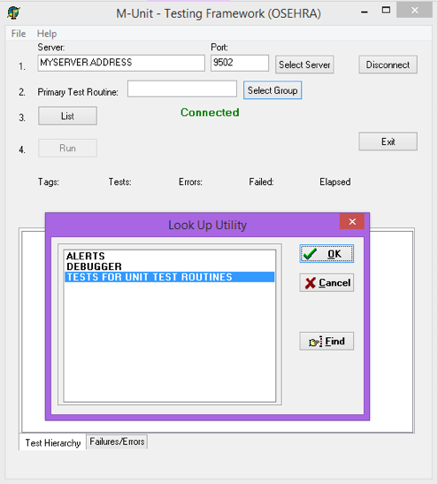
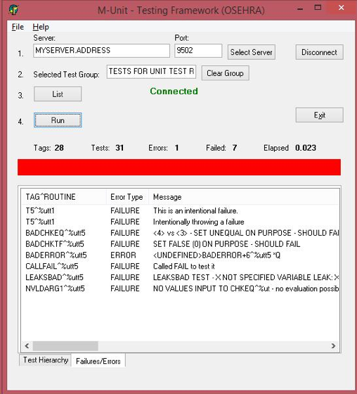
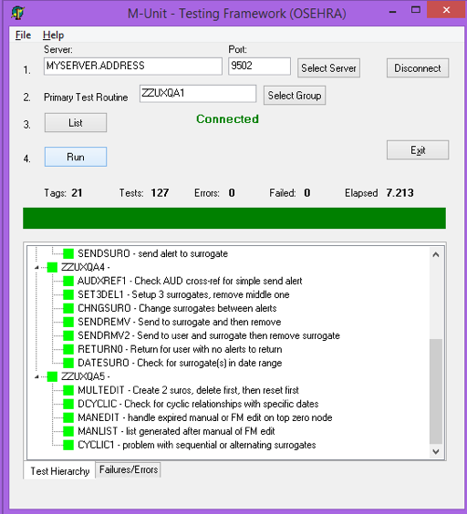

# %ut - A Unit Tester For M Code

Revision History

| Date          | Revision      | Description                           | Author    |
| ------------- | ------------- | ------------------------------------- | --------- |
| 07/31/14      | 0.1           | Draft                                 | Joel Ivey |
| 08/06/14      | 1.0           | Initial Publication                   | Joel Ivey |
| 08/29/14      | 1.0           | Revision                              | Joel Ivey |
| 08/10/15      | 1.1           | Revision                              | Joel Ivey |
| 09/14/15      | 1.2           | Revision                              | Joel Ivey |
| 12/12/15      | 1.3           | Revision – Coverage for Caché         | Joel Ivey |
| 04/11/16      | 1.4           | Revision – Corrections during install, addition of Verbosity value of 2 turns on timing of each test  | Joel Ivey Sam Habiel |
| 07/09/17      | 1.5           | Revision - Remove dependence on VistA environment, correct problem with Caché on computers with a name starting with digits, correct a few other miscellaneous problems identified    | Joel Ivey |
| 08/23/19      | 1.6           | Convert to Markdown, various minor edits | Christopher Edwards |
| 08/30/19      | 1.6           | Update of manual to add features for 1.6 | Sam Habiel |

## Purpose

This document describes M–Unit, a tool that permits a series of tests to be
written to address specific tags or entry points within an M project and act to
verify that the return results are as expected for that code. If run routinely
any time that the project is modified, the tests will act to indicate whether
the intended function has been modified inadvertently, or whether the
modification has had unexpected effects on other functionality within the
project. The set of unit tests for a project should run rapidly (usually within
a matter of seconds) and with minimal disruption for developers. Another
function of unit tests is that they indicate what the intended software was
written to do. This can be especially useful when new developers start working
with the software or a programmer returns to a project after a prolonged
period. Ensuring that well-designed unit tests are created for each project,
therefore, assists development, enhances maintainability and improves end-user
confidence in the deployed software.

The concept of Unit Testing was already in place before Kent Beck created
a tool that he used in the language Smalltalk, and then was turned into the
tool Junit for Java by Kent Beck and Erich Gamma. This tool for running
specific tests on facets of a software project was subsequently referred to as
xUnit, since NUnit was developed for .NET developers, DUnit for Delphi
developers, etc. M-Unit is the equivalent tool for M developers to use and was
originally created by Joel Ivey in 2003.

## Scope

This document describes the use of the M–Unit tools for building and running
unit tests for M code. It also describes the installation of the M–Unit
software.

### Introduction to M–Unit Testing

A Unit Test framework permits small tests to be written to verify that the code
under examination is doing what you expect it to do. Generally, the tests are
performed on the smaller blocks of the application, and do not necessarily test
all of the functionality within the application. These tests can be run
frequently to validate that no errors have been introduced subsequently as
changes are made in the code. The concept of automated Unit testing was
introduced by Kent Beck, the creator of eXtreme Programming methodology, with
a tool used in the language Smalltalk. The common JUnit framework for Java,
upon which other frameworks are based, was written by Kent Beck and Erich
Gamma. The phrase 'Test-Driven Development' is frequently used to indicate the
strong use of unit testing during development, although some think of it as
equivalent to 'Test First' development, in which the tests for code are written
prior to writing the code. In Test First Development, the test should initially
fail (since nothing has been written) and then pass after the code has been
written.

For client side languages, JUnit (for Java), DUnit (for Delphi), NUnit and
HarnessIt (for dotNet) all provide Unit Test frameworks. The routines `%ut`,
`%ut1` and `%utcover`, included in this version, provide the same capabilities
for unit testing M code and analysis of coverage of the code base by unit tests
in both GT.M and Caché systems. Initially, the client side tests were console
based (i.e., not windows, but just text), and that is what `%ut` provides. For
those who like pretty windows, there is an optional GUI front end,
MUnit_OSEHRA.exe, available for use (the GUI application does not currently
provide display of the coverage analysis).

### Getting Started

If you are going to modify sections of your code, or refactor , it is best to
create a unit test for those areas of the code with which you want to work.
Then the unit tests can be run as changes are made to ensure that nothing
unexpected has changed. For modifications, the unit tests are then written to
reflect the new expected behavior and used to ensure that it is what is
expected. One of the major benefits of unit testing is finding those unexpected
effects in other parts of your code due to the changes that the modified code
made.

The following is a very simple sample routine that covers everything necessary
for generating a basic unit test and includes examples of the various calls
available:

```M
XXXX    ;jli/jiveysoft - demo code for a unit test routine ;8/05/15 15:44
        ;;
        ; makes it easy to run tests simply by running this routine and
        ; ensures that %ut will be run only where it is present
        I $T(en^%ut)'="" D en^%ut("XXXX")
        Q
        ;
STARTUP ; optional entry point
        ; if present executed before any other entry point any variables
        ; or other work that needs to be done for any or all tests in the
        ; routine. This is run only once at the beginning of processing
        ; for the routine (This is modified from the prior version, which
        ; ran it only once for all processing).
        Q
        ;
SHUTDOWN        ; optional entry point
        ; if present executed after all other processing in the routine is
        ; complete to remove any variables, or undo work done in
        ; STARTUP.
        Q
        ;
SETUP   ; optional entry point
        ; if present it will be executed before EACH test entry in the
        ; routine to set up variables, etc.
        Q
        ;
TEARDOWN        ; optional entry point
        ; if present it will be executed after EACH test entry in the routine
        ; to clean up variables, etc.
        Q
        ;
ROUNAME ;;LOC/ID-DESCRIPTION; DATE
        ;;VER;PKG;;;;
        ; Example of calling test at top of routine so they can be run easily
        I $T(en^%ut)'="" D en^%ut(“TESTROU”)
        ; D en^%ut(“TESTROU”,1) ; used for verbose output
        ; D en^%ut(“TESTROU”,2) ; used for verbose output with timing
        ; D en^%ut("TESTROU",3) ; used for verbose output with finer timing
        ;
ENTRY1  ; Example for use of CHKEQ call to check two values
        ;
        ; code to generate a test, e.g. to check the sum of 1 and 1
        S X=1,Y=1
        D CHKEQ^%ut(2,X+Y,"1+1 didn't yield 2") ;
        ; or EQ^%ut(2,X+Y,"1+1 didn't yield 2") ;
        ; or eq^%ut(2,X+Y,"1+1 didn't yield 2") ;
        ;
        ; usage of CHKEQ^%ut
        ;   first argument is the expected value
        ;   second argument is the actual value
        ;   third argument is text to be displayed if the first argument
        ;      and second argument are not equal.
        ;
        ;   Multiple calls to CHKEQ^%ut may be made within one entry
        ;   point. Each of these is counted as a test.
        ;
        ;   Output for a failure shows the expected and actual values
        ;   and the message text, if any is supplied.
        Q
        ;
ENTRY2  ; Use of CHKTF call to check value for True or False
        ;
        S ERRMSG="Current user is not an active user on this system"
        D CHKTF^%ut($$ACTIVE^XUSER(DUZ)>0,ERRMSG)
        ; or TF^%ut($$ACTIVE^XUSER(DUZ)>0,ERRMSG)
        ; or tf^%ut($$ACTIVE^XUSER(DUZ)>0,ERRMSG)
        ;
        ; usage of CHKTF^%ut
        ;   first argument is an expression evaluating to true or false value,
        ;   second argument is text to be displayed if the first argument
        ;      evaluates to false.
        ;
        ;   Multiple calls to CHKTF^%ut may be made within one entry
        ;   point. Each of these is counted as a test.
        ;  
        ;   Output for a failure shows the message that has been input
        ;   with the test value.
        Q
        ;
ENTRY3  ; Use of CHKTF call to check values that should NOT be equal
        ;
        ; if you want to test something that should fail, use a NOT
        S X=1,Y=3
        D CHKTF^%ut(X'=Y,"indicated 1 and 3 are equal")
        ; or TF^%ut(X'=Y,"indicated 1 and 3 are equal")
        ; or tf^%ut(X'=Y,"indicated 1 and 3 are equal")
        Q
        ;
        ;   Note the @TEST on the line with the following tag, it indicates
        ;   that the tag is a unit test entry , the text following the @TEST
        ;   indicator is used as a description for the test.
ENTRY4  ; @TEST - Use of the FAIL call to generate a failure message
        ;
        ;   This API is used when code shouldn't be encountered, or some
        ;   other condition results that is considered a failure without
        ;   determining whether values are equal, or true/false conditions
        ;   exist.
        S X=1+2 I X'=3 D FAIL^%ut("System is doing bad addition on 1+2") Q
        ;             or fail^%ut("System is doing bad addition on 1+2") Q
        ;
        ; usage of FAIL^%ut
        ;   the argument is text indicating why the failure was identified
        Q
        ;
        ;    The following code would normally be encountered in the code
        ;    under test, but is included to show the use of the ISUTEST API
ENTRY5  ;
        S VALUE=1 ; a default value for use during unit tests
        I $T(ISUTEST^%ut)'="",'$$ISUTEST^%ut() R !,"Enter a value: ",VALUE:$G(DTIME,300)
        ;
        ;   $$ISUTEST^%ut() is used to determine whether the code is being
        ;   run as a part of a unit test, and may be used to use a default
        ;   value instead of asking the user to enter a specific value, etc.
        ;   Unit tests should impact production code as little as possible,
        ;   but this API does offer a means for determining whether it is
        ;   being run in a unit test or not.
        ;
        ;
        ; Other routine names to be included in testing are listed one per line
        ; with the name as the third semi-colon piece on the line and an
        ; optional description of what the routine tests as the fourth semi-
        ; colon piece, if desired this permits a suite of test routines to be
        ; run by simply starting one of the routine the names may be repeated
        ; in multiple routines, but will only be included once. The first line
        ; without a third piece terminates the search for routine names (which
        ; is why this is above the XTROU tag).
        Q
ENTRY6  ; @TEST
        N X S X=1+1
        D SUCCEED^%ut
        ; or succeed^%ut
        ; Use this when running code and all you want to tell M-Unit to capture
        ; is that the test succeeded without crashing. This is a good alternative
        ; for when you need need to type D CHKEQ^%ut(1,1,"Success").
        QUIT
        ;
XTROU   ;
        ;;XXXY;description of what the routine tests
        ;;XXXZ;
        ;;XXXA
        ;
        ; The use of XTENT to specify the tags to be used for tests was
        ; the original mechanism for specifying tests.  It is recommended
        ; that @TEST as the first non-space text on a test tag line after the ‘;’
        ; starting the comment be used for this purpose, (as shown for ENTRY4)
        ; although the use of XTENT continues to be supported.
        ; Entry points for tests are specified as the third semi-colon piece,
        ; a description of what it tests is optional as the fourth semi-colon
        ; piece on a line. The first line without a third piece terminates the
        ; search for TAGs to be used as entry points
XTENT   ;
        ;;ENTRY1;tests addition of 1 and 1
        ;;ENTRY2;checks active user status
        ;;ENTRY3;
        Q
```

Running XXXX as written above results in the following:

```M
>D ^XXXX
Referenced routine XXXY not found.
Referenced routine XXXZ not found.
Referenced routine XXXA not found.
...

Ran 1 Routine, 4 Entry Tags
Checked 3 tests, with 0 failures and encountered 0 errors.
>
```

You will not normally see routines that aren't there referenced, since you
would not include them. By default, passed tests are shown only with a dot and
the results are summarized at the bottom.  To illustrate a failure, change the
code on line `ENTRY+3` from `(X'=Y)` to `(X=Y)`. Running XXXX shows that the
test now fails. The location of the tag and the comment for failure are shown
in the order of the tests:

```M
>D ^XXXX
Referenced routine XXXY not found.
Referenced routine XXXZ not found.
Referenced routine XXXA not found.
..
ENTRY3^XXXX - indicated 1 and 3 are equal


Ran 1 Routine, 4 Entry Tags
Checked 3 tests, with 1 failure and encountered 0 errors.
>
```

Now change the code on line `ENTRY1+3` so that `S X=1,Y=1` becomes `X=1,Y=1`
(removing `S<space>`. Running XXXX again identifies the error generated due to
our typing, as well as continuing on to show the failure we introduced at
`ENTRY3`. The test at `ENTRY2` still runs without a problem, as indicated by
the lone dot.

```M
>D XXXX
Referenced routine XXXY not found.
Referenced routine XXXZ not found.
Referenced routine XXXA not found.

ENTRY1^XXXX - tests addition of 1 and 1 - Error: ENTRY1+3^XXXX:1,
%DSM-E-COMAND, bad command detected
.
ENTRY3^XXXX - indicated 1 and 3 are equal


Ran 1 Routine, 4 Entry Tags
Checked 3 tests, with 1 failure and encountered 1 error.
>
```

If the code at `ENTRY4+2` is now modified to `S X=1+1` and running it causes
the `FAIL` call to be used.

```M
>D XXXX
Referenced routine XXXY not found.
Referenced routine XXXZ not found.
Referenced routine XXXA not found.

ENTRY1^XXXX - tests addition of 1 and 1 - Error: ENTRY1+3^XXXX:1, %DSM-E-COMAND, bad command detected
.
ENTRY3^XXXX - indicated 1 and 3 are equal

ENTRY4^XXXX - example of FAIL^%ut call - System is doing bad addition on 1+2


Ran 1 Routine, 4 Entry Tags
Checked 4 tests, with 2 failures and encountered 1 error.
>
```

Restoring `S<space>` on line `ENTRY1+3`, and changing `X=1` to `X=2` and
running it shows the output of the `CHKEQ` call.

```M
>d XXXX
Referenced routine XXXY not found.
Referenced routine XXXZ not found.
Referenced routine XXXA not found.

ENTRY1^XXXX - tests addition of 1 and 1 - <2> vs <3> - 1+1 didn't yield 2
.
ENTRY3^XXXX - indicated 1 and 3 are equal

ENTRY4^XXXX - example of FAIL^%ut call - System is doing bad addition on 1+2


Ran 1 Routine, 4 Entry Tags
Checked 4 tests, with 3 failures and encountered 0 errors.
>
```

M-Unit 1.6 added the ability to specify specific tests to be run while all the
rest would be ignored.  This would be used when one or a few specific tests
need to be focused on to fix a problem.  Changing the `@TEST` on line `ENTRY4`
to `!TEST` would result in only that line and other tags marked with `!TEST`
being run during a test.

```M
ENTRY4  ;  !TEST - Use of the FAIL call to generate a failure message
        ;
        ;   This API is used when code shouldn't be encountered, or some
        ;   other condition results that is considered a failure without
        ;   determining whether values are equal, or true/false conditions
        ;   exist.
        S X=1+2 I X'=3 D FAIL^%ut("System is doing bad addition on 1+2") Q
        ;
        ; usage of FAIL^%ut
        ;   the argument is text indicating why the failure was identified
        Q
```

In the early days of M-Unit work, the unit test routines were generated with
the first four characters of their name as `ZZUT`.  This was chosen so that the
routines would not normally be exported with a package, because the developers
who worked with the routines were generally working in the same account.

However, the routines **SHOULD** be included in builds so that others may also
ensure, using the unit tests, that the routines are running correctly.  And, in
an open source world, that others may work to extend the current work using the
unit tests that were generated.  For this reason, unit tests should be given
the same namespace as other routines in the build, and included as a part of
the build.  If a four character namespace were `NMSP`, it is recommended that
unit test routines be given the namespace `NMSPU` followed by characters to
indicate the specific code they are related to.

Unit tests should run rapidly, so that they can be run and not impact the
developer's (or tester's) time.  If they take more than a few seconds to run,
they may be put off until later or not run at all.  If all of the tests are
taking longer than a few seconds to run, then identify the tests that are
taking longer.  Running the tests in verbose mode when they are taking a long
time will make the longer running tests easily identifiable as they run.  And
the current version includes, thanks to Sam Habiel, the ability to actually
determine the length of time that the individual unit tests are taking. Using
the `EN^%ut` API call for the unit test routine with a value of two as the
second argument (`VERBOSITY`), will output the times in milliseconds for each
unit test, using a value of three will show the execution times as fractional
milliseconds.  Once long running unit tests have been identified, modify the
unit tests so they will test the specific code for testing in a quicker manner.
For example, if code is present that performs an analysis on each entry in
a file, then the unit test should be set up to isolate the analysis itself, and
then test performing the analysis on one or two selected entries in the file
instead of all of them.

That covers the basics of generating a unit test routine to use with `%ut`. For
sections of code performing calculations, etc., this is all that will be
required. For other cases, depending upon database interactions or of input and
output via something like the RPCBroker, other approaches to creating usable
tests are required. These 'objects,' which can be used for consistency in such
units tests, are generally referred to as 'Mock Objects.'

#### M–Unit Test Dos and Don'ts

You do not want to include any code which requires user input. You want the
tests to be able to run completely without any user intervention other than
starting them. By referencing other, related unit test routines within the one
that is started, you can build suites of tests that can be used to cover the
full range of your code.

#### M–Unit Test Definitions

Supported References in `%ut` are `EN/en`, `CHKTF/TF/tf`, `CHKEQ/EQ/eq`,
`FAIL/fail`, `SUCCEED/succeed`, `CHKLEAKS`, `ISUTEST`, `RUNSET`, `COV`,
`COVERAGE`, `MULTAPIS`, `GETUTVAL`, and `LSTUTVAL`. It should be noted that COV
was previously available in %ut1, and was moved to %ut so all supported
references could be accessed in %ut (without challenging memories). The
supported references `COVERAGE`, `MULTAPIS`, `GETUTVAL`, and `LSTUTVAL` were
added as new functionalities in a previous version.

The entry point `EN/en^%ut(ROUNAME,VERBOSE,BREAK)` starts the unit testing
process. The first argument is required and provides the name of the routine
where the testing should be started. That routine must have at least one test
entry point (and possibly more) either specified in the line(s) immediately
following the tag `XTENT` as the third semi-colon piece on the line OR it can
have tags with `@TEST` as the first text of the comment for the tag line.  The
second argument (optional) is `VERBOSE` - if it evaluates to true (e.g., 1)
will turn on verbose mode, which lists each individual test being run as well
as its result.  If the `VERBOSE` argument has a value of two or three, it will
output in verbose mode, and include the time that each of the unit tests take
to run (2 for milliseconds, 3 for fractional milliseconds [on GT.M systems, the
latter (3) is active only for version 6.3 and above]).  The third argument
(optional) is `BREAK` - if it evaluates to true it will cause the M-Unit Test
process to terminate upon a failure or error instead of continuing until all
tests have been evaluated before finishing, as it normally does. This is
useful to break when a unit test fails so that you can inspect the symbol
table and other variables at the failure point.

A test is performed on a conditional value by calling the entry point
`CHKTF/TF/tf^%ut(testval,message)` with the first argument the conditional test
value (true or false) and the second argument a message that should be
displayed indicating what failed in the test.

A test checking two values for equivalence is performed by using the entry
point `CHKEQ/EQ/eq^%ut(expected,actual,message)` with the first argument the
expected value, the second argument the actual value, and the third argument
the message for display on failure.

The entry point `FAIL/fail^%ut(message)` is used to simply generate a failure
with the argument as the message to be displayed for the failure.  This is
normally used in a section of code that would not be expected to be processed.

The entry point `SUCCEED/succeed^%ut` is used to indicate success outside of
a TF/EQ check. Use this when running code and all you want to tell M-Unit to
capture is that the test succeeded without crashing. This is a good alternative
for when you need need to type `D CHKEQ^%ut(1,1,"Success")`.

The entry point `DO CHKLEAKS^%ut(CODE,TESTLOC,.NAMEINPT)` can be used within
unit tests or in a stand alone test for variable leaks (those variables which
are created within called code that are allowed to leak into the calling
environment, unintentionally). The `CODE` argument would contain a command to
be executed in the test for leaks (e.g., `"S X=$$NOW^XLFDT()"`).  The `TESTLOC`
argument would indicate the location under test for output and identification
purposes (e.g., `"$$NOW^XLFDT() leak test"` or simply `"$$NOW^XLFDT"`).  The
`NAMEINPT` variable is passed by reference, and is an array which contains
a list of all variables that the user is passing in and/or expects to be
present when the code is finished (the variable `X` would be in the latter
category, since it would then be present).  The input is in the form of an
array `NAMEINPT("VARNAME")="VARVALUE"`, where `VARNAME` is the name of
a variable, and `VARVALUE` is the value that is to be assigned to the variable
before the contents of `CODE` is to be executed.  When run in a unit test
environment, variables that are present after the contents of `CODE` is
executed that were not included in `NAMEINPT` as variables, will be listed as
failures.  When called outside of a unit test environment, any leaked variables
will be listed on the current device.

The entry point `ISUTEST^%ut` is an extrinsic function used as `S
X=$$ISUTEST^%ut`, and if a unit test is currently running, it will return
a value of 1, otherwise it returns a value of zero.  This can be used to select
code to be run based on whether it is currently being tested (or something else
that calls it is being tested).

The entry point `COV^%ut` provides coverage.  Usage is

```M
DO COV^%ut(.NAMESPAC,CODE,VERBOSITY)
```

where the argument `NAMESPAC` is passed by reference and indicates the routine
namespace(s) to be analyzed.  If `NAMESPAC` is only a routine name, only that
routine will be included in the analysis.  If `NAMESPAC` includes a terminal
asterick (e.g., `"NAMESP*"`), then all routines which begin with the specified
characters will be included in the analysis.  Since it is now passed by
reference, coverage analyses of multiple namespaces may be run at the same time
(e.g., `NAMESPAC="NAMSP1*",NAMESPAC("NAMSP2*")=""` will run both namespaces
beginning with `NAMSP1` and `NAMSP2` at the same time.  This can also be used
to specify several individual routines (e.g.,
`NAMESPAC="%ut",NAMESPAC("%ut1")="",NAMESPAC("%utcover")` can be used to test
the actual unit test routines while ignoring the test routines for them
(`%utt*`).  The argument `CODE` is the code to be executed when running the
analysis (e.g., `"D EN^%ut(""ROUTINE"")"`).  This code will be run and coverage
of the routines involved will be tracked, and those within the namespace
indicated will be shown to the user.  The third argument, `VERBOSITY`,
determines how much information will be shown to the user.  A value of 1 will
show only the total coverage (number of lines covered out of total number of
lines and a percentage) for each routine in the namespace specified as well as
the totals for all routines analyzed.  A `VERBOSITY` value of 2 will show that
information as well as the coverage values for each tag within the routines.
A `VERBOSITY` value of 3 will show the information from 1 and 2, and displays
the actual lines under each tag that were NOT covered in the analysis.  The
latter can be quite a bit of information.

The entry point `COVERAGE^%ut` was added to handle those cases where there may
be a number of different ways in which the unit tests are run, for example from
the `EN^%ut("ROUTINE")` call; from a call to the top level of a production
routine which then calls the unit test routine; and from a separate call within
the production routine to run a verbose version of the unit tests, as well as
adding the ability to specify routines in the namespace that should be ignored
(we aren't really interested in the coverage of the unit test routines).  The
usage is

```M
DO COVERAGE^%ut(.NAMESPAC, .TESTROUS,.XCLUDE,VERBOSITY)
```

where the first and fourth arguments are the same as for the `COV^%ut` entry
point.  The second argument is an array passed by reference where the
subscripts and/or values may specify routines or APIs to be run in the overall
analysis.

```M
SET TESTROUS(1)="TESTURO1,EN1^TESTROU1,^TESTROU2"
SET TESTROUS("VERB^TESTROU2")="TESTURO2,TESTURO3"
```

Any routine reference without a '^' would be run as a call to `EN^%ut` with the
routine name as argument, those with a '^' character would be run as simple DO
commands (e.g, `D ^TESTROU2` and `D VERB^TESTROU2`).  All commands specified
will be processed as part of a single analysis, and if subsequent tests attempt
to start a coverage analysis, they will simply be included with the current
analysis (previously they would remove previously collected data).  The
`TESTROUS` example above would result in six different unit tests being
launched as a part of the overall coverage analysis.

The third argument is an array passed by reference where the routine names that
are to be excluded from the analysis are specified as subscripts for the array
and/or as comma separated list of routine names in the array values.

```M
SET XCLUDE("TESTURO1")="TESTURO2,TESTURO3"
SET XCLUDE(1)="TESTURO4"
```

This array would cause four unit test routines to be excluded from the analysis
generated.

The entry point `MULTAPIS^%ut` was provided to permit multiple unit tests to be
run in the same manner as with the `COVERAGE^%ut` API, but without the coverage
analysis.  The usage is:

```M
DO MULTAPIS^%ut(.TESTROUS)
```

The argument is the same as the second argument in the `COVERAGE^%ut` call.
Since coverage analysis is not involved, namespace, exclusions, and verbosity
(at least of coverage analysis) are not necessary.

The `GETUTVAL^%ut` API is provided for those cases where a series of separate
unit tests may be run, and the user wishes to display a summary for all of
them. The `GETUTVAL` API would be called after each individual unit test is
run.  The usage is:

```M
DO GETUTVAL^%ut(.UTVALS)
```

Where the argument is an array passed by reference which will be populated the
first time it is called and subsequent calls are used to update the values.
The array's subscripted values are:

1) cumulative number of routines run
2) cumulative number of entry tags
3) cumulative number of tests
4) cumulative number of failures
5) cumulative number of errors

The cumulative values may be used by the program, or they may be displayed with
the `LSTUTVAL` API.

The `LSTUTVAL^%ut` API provides a manner to list the cumulative results from
calls to `GETUTVAL^%ut` in a manner similar to that listed after each unit test
sequence is called.  The usage is

```M
DO LSTUTVAL(.UTVALS)
```

Where the argument is passed by reference and is the same array used in the
preceding calls to `GETUTVAL^%ut`.  The output appears similar to

```sh
------------ SUMMARY ------------
Ran 18 Routines, 96 Entry Tags
Checked 266 tests, with 14 failures and encountered 2 errors.
```

For those who have problems keeping track of routine names for unit testing and
which application they are associated with, the file `M-UNIT TEST GROUP
(#17.9001)` can be used to maintain groups of unit test routines with the edit
option `"utMUNIT GROUP EDIT"` (M-Unit Test Group Edit). These may be run from
the option `"utMUNIT GROUP RUN"` (Run M-Unit Tests from Test Groups), or from
a Supported Reference [`D RUNSET^%ut(setname)`], or from the GUI client
described below (click the 'Select Group' button).

While the order of processing within M unit tests may actually be fairly
constant, or at least appear to be so, it is preferable to have the unit tests
independent of the order in which they are run. Having dependencies between
tests can result in problems if the order were to change or if changes are made
in the test being depended upon. While `STARTUP` and `SETUP` tags are
available, there are those who recommend caution even in using them.

#### MUnit GUI

The GUI MUnit application provides a visually interactive, rapid method for
running unit tests on M code. The GUI interface for M UNIT is available as part
of the binary release. It should be saved and the file unzipped into any
desired directory. If desired, a shortcut containing specifications for
a server and port (e.g, `munit.exe s=server.myaddress.com p=9200`) can be set
up to start MUnit.exe.

* Start the application either double clicking on it or the shortcut.
* Select or Change the server/port specifications if necessary, and click on
  the 'Connect' button.
* After specifying the server address and port, the user can sign on or click
  the Select Group button to select a unit test from the `M-UNIT TEST GROUP file
  (#17.9001)` as shown here (Figure 1).


*Figure 1. Selection of an M-Unit test*

You could also simply enter the name of a unit test routine in the Primary Test
Routine field and click on List (Click on the Clear Group button to clear
previous selections). This will bring up a list of the routines and tags in the
unit test run (Figure 2).


*Figure 2. List of Unit tests selected for running*

Clicking the Run button will run the unit tests, resulting in a bar which is
green if all tests pass or red if any failures or errors are encountered
(Figure 3).


*Figure 3. The unit tests run with failures*

If failures or errors are encountered, clicking on the Failures/Errors tab at
the bottom of the listing opens a display of specific information on the
problems (Figure 4).


*Figure 4. Specifics on failed tests or errors*

In the case shown (Figure 4), all of the failures are intentional. Usually,
failures and/or errors are not intentional and the user can then edit the
routine, and save the changes, then simply click on the Run button again to see
the effect of the changes.

To select a new unit test, the user would click on the Clear Group button, then
again either select another group or as shown in Figure 5, entering the name of
a unit test routine (`ZZUXQA1` and related routines are not included with the
M-Unit Test code and is shown only as an example) and clicking on the List
button.


*Figure 5. Specification of unit tests by routine name*

Again, clicking the Run button will run the unit tests (Figure 6). This figure
shows the desired result, a green bar meaning that all tests passed.


*Figure 6. Result from the second group of unit tests*

#### Installation of the M–Unit Software

The installation software for the M–Unit Tools is usually available as either
a RO or as a KIDS build file. The basic M–Unit Tools could be loaded from
routines only if the usage will be at the command line only (thus not needing
the options and remote procedures included in the build).

For installation from a KIDS build file:

* from the EVE ('System Manager Menu') menu, select:
  * 'Programmer Options'
  * the KIDS ('Kernel Installation & Distribution System') menu
  * and 'Installation', followed by 1 or 'Load a Distribution,'
* at the prompt, enter the host file name (and if using Caché, the directories, if not in the current namespace directory),
* then enter 6 (for 'INSTALL/CHECK MESSAGE') and follow the subsequent prompts.
* The following is an example installation on a Caché system.

In a recent version, Sam Habiel provided an update for the preinstall routine
(ZZUTPRE) to improve setting the %ut namespace for routines and globals to the
current VistA account.

See the document [KIDS_INSTALL_TRANSCRIPT.TXT](KIDS_INSTALL_TRANSCRIPT.TXT) for
a transcript of an installation.

Installation on a Linux system is basically the same as shown for Caché.
However, the `dos2unix` command should be run on the KID file first to ensure
the correct line endings. Also, GT.M will list a number of error messages for
Caché specific syntax that it does recognize. These should be ignored.  

#### M-Unit without VistA support

The current version can be run in an M environment which does not contain
VistA.  This can only be used at the command line, since VistA is required for
the GUI application to run.  The unit tests for the routines (`DO ^%utt1`) can
be run to verify the functionality.

For a Caché environment, set up the `%ut*` namespace for the account namespace
(Right click and select Management Portal, when the page opens in a browser
select 'System Administration | Configuration | SystemConfiguration
| Namespaces' then select the desired namespace from those listed (e.g., User)
and click on 'Routine Mappings'.  In the new page in the browser click on 'New
Routine Mapping', in the 'Routine Database Location' select the desired
namespace to match the one you are using, then in the 'Routine name' edit box
enter %ut* then click on 'OK', and in the 'Routine Mappings' page click on
'Save Changes' to have it identify the %ut* routines in the namespace account.
Then use `DO ^%RI` to load them from the `M-UNIT_XXX.RSA` file (or individually
`ZL` them in an account where they are present, then `D ^%CD` to the desired
namespace and `ZS` the routine in the account).

For a GT.M environment, you can copy the `M-UNIT_XXX.RSA` file into a unix
environment, use the command `dos2unix` to convert the file to the appropriate
line endings, then use the `DO ^%RI` command and load the file from its
location.  This will convert the routines to `_ut*` for storage.

#### Running M-Unit Tests

Once the installation is complete, you can verify that the %ut test framework
has been installed correctly by running the supplied test routines.

There are several routines that can be run to test various areas of the M-Unit
functionality.  Running the routine `%utt1` from the top (i.e, `DO ^%utt1`)
will run the non-verbose mode of the basic tests.  The routine `%utt6` when run
from the top (`DO ^%utt6`) or in verbose mode (`DO VERBOSE^%utt6`) runs
a variety of tests for APIs covering the command line, options, and GUI, and
the routine `%uttcovr` is run from the top to perform coverage analysis for the
`%ut`, `%ut1` and `%utcover` routines. Entering the following command at the
VistA command prompt will run the basic tests (and the 8 failures and 1 error
are caused on purpose to test specific parts of the code associated with
failures and errors):

```M
Running tests in NON-VERBOSE mode
For Verbose mode use DO VERBOSE^%utt1(ARG) where ARG is an integer 1 to 3
ENTER RETURN TO CONTINUE: ....
T5^%utt1 - Error count check - This is an intentional failure
.
T5^%utt1 - Error count check - Intentionally throwing a failure
......%utt3 ...........
FAIL^%utt2 - Rename of FAIL - THIS TEST SHOULD FAIL - no failure message provided
.
Loading routines to test coverage...
%utt3

 ----------------------------------- %utt3 -----------------------------------
T1 - Test 1.-----------------------------------------------------------  [OK]
T2 - Test 2.-----------------------------------------------------------  [OK]

Ran 1 Routine, 2 Entry Tags
Checked 2 tests, with 0 failures and encountered 0 errors.........
BADCHKEQ^%utt5 -  CHKEQ should fail on unequal value - <4> vs <3> - SET UNEQUAL ON PURPOSE - SHOULD FAIL

BADCHKTF^%utt5 -  CHKTF should fail on false value - SET FALSE (0) ON PURPOSE - SHOULD FAIL

BADERROR^%utt5 -  throws an error on purpose - Error: 150372778,BADERROR+6^%utt5,%YDB-E-EXPR, Expression expected but not found

CALLFAIL^%utt5 -  called FAIL to test it - Called FAIL to test it

LEAKSBAD^%utt5 - check leaks with leak - LEAKSBAD TEST - X NOT SPECIFIED VARIABLE LEAK: X

NVLDARG1^%utt5 - check invalid arg in CHKEQ - NO VALUES INPUT TO CHKEQ^%ut - no evaluation possible
.............................................................................

Ran 6 Routines, 40 Entry Tags
Checked 116 tests, with 8 failures and encountered 1 error.
```

Full captures of the tests running `DO ^%utt1` [equivalent to `EN^%ut("%utt1")`
since running `%utt1` from the top does run that code and then quits] and
running `DO ^%uttcovr` [performing full coverage analysis on the `%ut`, `%ut1`,
and `%utcover` routines using the `COVERAGE^%ut` API) on both GT.M and Caché
are available in the documents

* [CACHE-VISTA-RESULTS.TXT](CACHE-VISTA-RESULTS.TXT)
* [GT.M-VISTA-RESULTS.TXT](GT.M-VISTA-RESULTS.TXT)
* [GT.M-NO-VISTA-RESULTS.TXT](GT.M-NO-VISTA-RESULTS.TXT)

The supplied tests can be run manually, but are also part of the OSEHRA VistA
Automated Testing harness. For instructions on how to acquire and run the tests
via the OSEHRA harness see the online documentation at:

* [Obtaining Testing Code](https://github.com/OSEHRA/VistA/blob/master/Documentation/ObtainingTestingCode.rst)
* [Running and Uploading Tests](https://github.com/OSEHRA/VistA/blob/master/Documentation/RunningandUploadingTests.rst)

Then execute the following CTest command to run the tests:

```sh
ctest -R UNITTEST_Mash_Utilities
```
